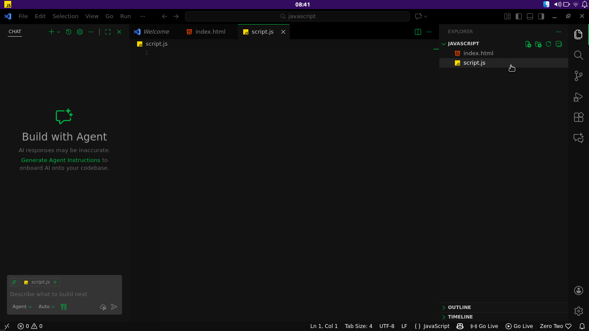
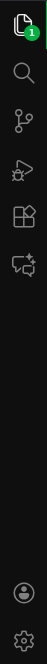
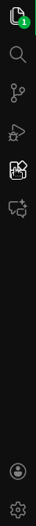
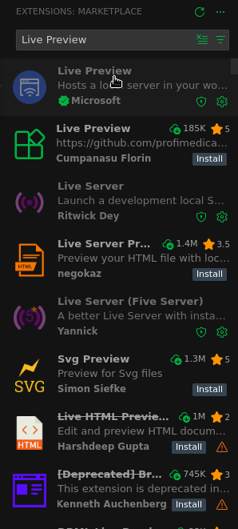
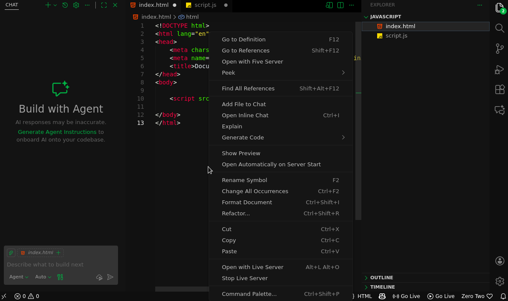
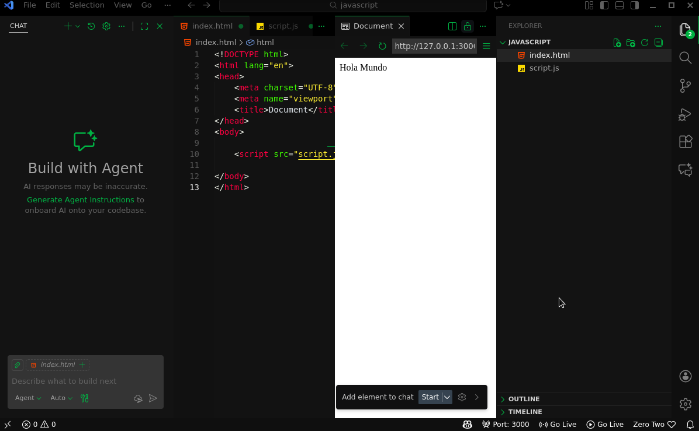

# 1. COMO CORRER Javascript

Hay varias maneras de correr JavaScript (Js),  
pero para este curso usaremos la profesional.

La cual es crear un archivo html y un archivo  
Js, ¿cómo se crean estos archivos?...

(para eso recomendamos tomar el curso basico de IDE)

---

## PASO 1 :

- Creamos Una Carpeta nueva en (culaquier) lugar
- Abrimos la carpeta
- Click Derecho dentro de la carpeta
- Le damos click en **"abrir con"**
- La abrimos con Visual Studio Code
- Una vez dentro de code:
  - Creamos 2 archivos  
    `Index.html`  
    `Script.js`

---

## PASO 2 :

- Dentro del documento html ponemos el signo **"!"**  
  (ver curso de html)

- Damos enter y se nos crea la estructura de un  
  documento HTML5

- Nos dirigimos a la parte final de `<body>`  
  y damos enter. Debería quedarnos algo así:
 <br>

 <details>
  <summary> <strong> Codigo... </strong> 
   </summary>
  
    
    <!DOCTYPE html>
    <html lang="en">
    <head>
    <meta charset="UTF-8">
    <meta name="viewport content="width=device-width, initial-scale=1.0">
    <title>Document</title>
    </head>

    <body>
  
    <!-- Justo aqui -->

    </body>


    </html>

 </details>

<br>

Aquí es donde se vincula nuestro HTML con
nuestro JavaScript.


# PASO 3 :

Le damos click al archivo que dice **script.js**
Debería aparecer vacío y con un icono amarillo.




Escribimos lo siguiente:


```javascript
document.write("Hola Mundo");
```

# PASO 4 :

- Instala la extension live-preview...como?

  <details>
  <summary>
    <strong> Instalacion (obligatoria) </strong>
  </summary>


  - Ves a la parte de :

  
  
  - das click a :

  

  - buscas **"Live Preview"**

  

  - le das **"install"**, cuando instale
  vas a tu html

  - clic derecho sobre tu documento :

   

  - buscamos el apartado de **"Show Preview"**

  

  - Se te despliega algo asi : 

  


  </details>

con todos estos pasos podras ejecutar Js en el navegador de manera facil y sencilla...


# PASO 5 :

**LISTOOOOOOOO**

**FELICIDADES HICISTES TU PRIMER CODIGO Js**.

PD: Ya veremos qué es document.write, no te desesperes...

**Escrito por "Viper."**

---

### Siguiente Clase ----------->

---